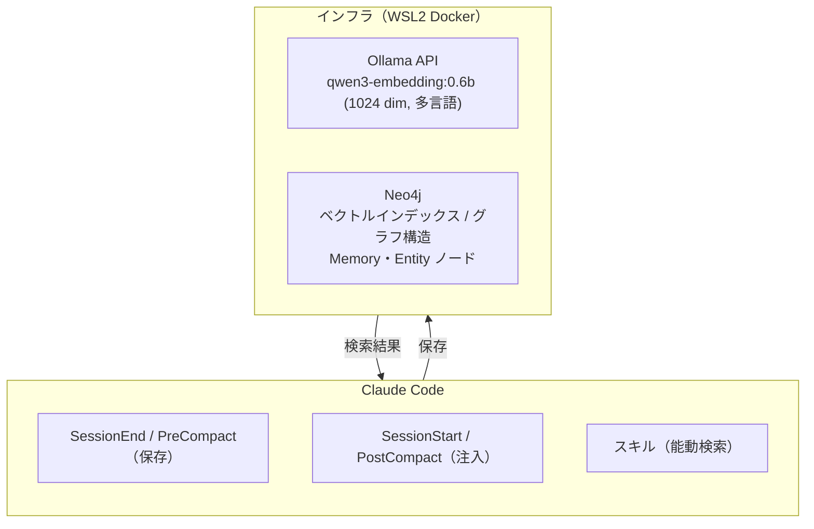

# Long-Memory システム 概要

## 1. 対象ユースケース

| # | ユースケース | 問いの形 |
|---|---|---|
| UC1 | 知識参照 | 「X について何を知っているか」 |
| UC2 | 意思決定の想起 | 「なぜ X を選んだか・なぜ Y をやめたか」 |
| UC3 | 評価結果の活用 | 「X を評価したときの結論は何か」 |
| UC4 | 暗黙の技術的文脈の蓄積 | 「このコードを触るとき何に気をつけるべきか」 |

---

## 2. システム概要

Claude Code に「会話をまたいで記憶を持続させる」長期記憶機能を付与するサブシステム。  
**Neo4j によるグラフ構造**と **Ollama Embedding API** を組み合わせることで、以下を実現する：

- 直接的な意味的類似がなくても、**共通エンティティを介した関連記憶の取得**
- **エンティティ間関係**の蓄積による文脈理解の深化
- **ベクトル検索 × グラフトラバーサル**のハイブリッド検索

### 設計原則

| 原則 | 内容 |
|---|---|
| フック駆動 | Claude Code のフックで自動保存・自動注入（フック種別は後述） |
| Neo4j 一元管理 | ベクトルデータも関係グラフも Neo4j に集約（外部ベクトル DB 不要） |
| 日本語最適化 | Embedding モデルを日本語特化モデルで運用 |
| グラフ拡張検索 | ベクトル類似 Memory から Entity を辿り、関連 Memory を芋づる式に発見 |
| 抽出ベース保存 | 会話テキストをそのままチャンク化せず、LLM で事実・決定事項を抽出してから保存 |

---

## 3. アーキテクチャ概観



### フックの役割分担

| フック | タイミング | 役割 |
|---|---|---|
| `SessionEnd` | 会話終了時 | save（トランスクリプトから記憶を抽出・保存） |
| `PreCompact` | コンテキスト圧縮直前 | save（圧縮で消える文脈を記憶として保存） |
| `SessionStart` | セッション開始時 | inject（関連記憶をシステムプロンプトに注入） |
| `PostCompact` | コンテキスト圧縮直後 | inject（圧縮後の新しいコンテキストに記憶を注入） |

### データフロー

**保存フロー（SessionEnd / PreCompact）**
```
会話トランスクリプト
  → LLM で事実・決定事項・観察を抽出（extractor.py）
      ├── knowledge : 事実・観察・発見
      ├── decision  : 採用・却下が確定した意思決定
      └── tentative : 未確定の検討事項・仮説
  → Ollama API で各項目の Embedding 生成
  → エンティティ抽出（固有名詞・技術名・概念）
  → fugashi（MeCab）で形態素解析し content_tokens（全文インデックス用）を生成
  → Neo4j に Memory ノード・Entity ノード・関係エッジを書き込み
```

**注入フロー（SessionStart / PostCompact）**
```
クエリ生成（フックイベントにより異なる）
  - SessionStart  : 初回メッセージをそのままクエリとして使用（文脈理解なし）
  - PostCompact   : 圧縮後の直近メッセージを結合してクエリを生成
  → Ollama API でクエリ Embedding 生成
  → Neo4j ベクトル検索（類似 Memory を K 件取得）
  → 取得 Memory から MENTIONS エッジで Entity を展開
  → Entity から CO_OCCURS_WITH エッジで関連 Entity を展開
  → 関連 Entity に接続する Memory を追加取得
  → スコアリング（ベクトル類似度 + グラフ距離 + 時間減衰 + 重要度）で再ランキング
  → 上位 N 件をシステムプロンプトへ注入
```

**能動検索フロー（スキル）**
```
ユーザーが明示したキーワード（ファイルパス・関数名・テーマ等）
  → 同上の検索処理
  → 結果を会話に出力（注入ではなく表示）
```
