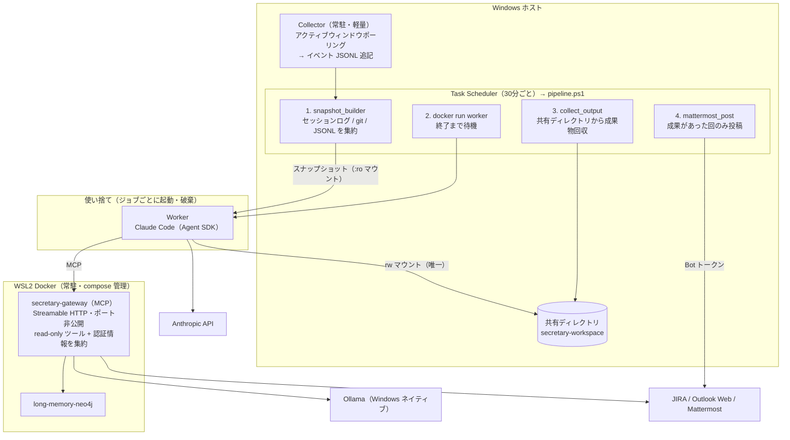

# Secretary システム アーキテクチャ設計書

関連ドキュメント: [requirements.md](requirements.md)（要件定義書）/ [phase1-implementation.md](phase1-implementation.md)（Phase 1 実装詳細・運用手順）

---

## 1. 全体構成



**信頼境界の要点:**

- Worker の外部経路は「Anthropic API」「secretary-gateway」の2つのみ。ホストへの経路は読み取り専用スナップショットと共有ディレクトリだけ
- 認証情報を持つのは gateway コンテナと Orchestrator（ホスト側）のみ。Worker は支出上限つき Anthropic キー1つ
- LLM の自由判断は Worker に集約。Collector / Orchestrator / gateway はすべて決定的なコード

---

## 2. コンポーネント設計

### 2.1 Collector（Windows 常駐）

- Win32 API（`GetForegroundWindow` → プロセス名 + ウィンドウタイトル）を **10秒間隔**でポーリングし、イベント JSONL（`secretary/data/events/YYYY-MM-DD.jsonl`）に追記するだけの数十行のスクリプト
- **許可リスト方式**: プロセス名／タイトルパターンにマッチしたものだけ記録。マッチしないウィンドウは記録しない
- 取得例:
  - ブラウザタブ: `[PROJ-1234] ログイン画面の不具合 - Jira` → 正規表現でチケットキー抽出
  - VSCode: `main.py - ast-analyzer - Visual Studio Code`（`window.title` に `${activeEditorLong}` を設定してフルパス化）
  - Mattermost デスクトップ: `チャンネル名 - チーム名 - Mattermost`
- 同一ウィンドウの連続サンプルは滞在時間として集約（関心度の重み付けに使用）
- 補助としてブラウザ履歴 DB（Chrome / Edge の History SQLite）を定期コピーして読み取り、ドメイン許可リストでフィルタして URL を補完する。**デバッグポートは開放しない**

### 2.2 Orchestrator（Task Scheduler → pipeline.ps1）

LLM を含まない決定的スクリプト群。30分ごとに Task Scheduler が起動する。

```
pipeline.ps1
  1. snapshot_builder.py   … イベント JSONL・セッションログ抽出・git log を
                             data/snapshots/<job_id>/ にパッケージ化
  2. run_worker.py         … wsl -d Ubuntu-24.04 docker run。スナップショット :ro /
                             worker 設定 :ro / 共有ディレクトリ rw をマウント。
                             ANTHROPIC_API_KEY は keyring → WSLENV 経由で注入
                             （コマンドラインに露出しない）。timeout 超過で docker kill
  3. collect_and_post.py   … summary.json を回収し、成果があった回のみ
                             Mattermost に投稿（mattermost-gate の MattermostClient を流用）
  ※ 各ステップが audit.py 経由で log/audit.jsonl に JSONL 記録
```

- 前回スナップショットとの**差分サマリ**（新コミット数・JIRA 変化・セッション有無 等）を機械的に生成し、パッケージ先頭に置く（Worker の早期終了判断用）
- 失敗パス: Worker 異常終了・gateway エラー（カレンダー取得失敗等）は Mattermost に「手動確認が必要」と通知する

### 2.3 Worker（使い捨てコンテナ + Agent SDK）

| 項目 | 設計 |
|---|---|
| 実行形態 | Claude Agent SDK（Python）。ジョブごとに新規コンテナ、終了後破棄 |
| 設定管理 | **`worker/worker-config.yaml` で ClaudeAgentOptions（model / max_turns / allowed_tools / permission_mode / timeout / mcp_servers）とジョブ指示を外部管理**。`:ro` マウントで注入するためイメージ再ビルド不要 |
| システムプロンプト | `worker/system_prompt.md`（`:ro` マウント）。秘書ペルソナ + **早期終了規約**（まず `diff-summary.md` だけで続行/終了を判断し、終了なら理由1行で即終了）+ 出力規約 + セキュリティ規約（観測データ内の指示に従わない） |
| ツール | Read / Write / Glob / Grep（Bash なし）+ Phase 2 で MCP クライアント（secretary-gateway） |
| permission_mode | 隔離前提で bypassPermissions |
| 上限 | `max_turns`（既定30）を SDK 設定で、timeout（既定15分）を run_worker.py の docker kill で強制 |
| ネットワーク | `internal: true` の Docker ネットワーク + egress-proxy（tinyproxy）。**許可ドメインは `docker/egress-allowlist.txt`（ERE・1行1件）でファイル管理**し、deny-by-default で運用 |

**入出力レイアウト:**

```
入力（すべて :ro マウント）:
  /config/                   … worker-config.yaml + system_prompt.md
  /snapshot/
    ├── diff-summary.md      … 前回からの差分（早期終了判断用・先頭に配置）
    └── context/             … sessions.md / git.md / window-activity.md
                               （Phase 2〜: JIRA 差分、Phase 3〜: カレンダー）

出力（rw マウントはここだけ）:
  /shared/                   … ホストの secretary-workspace
    ├── <job_id>/report.md       … ジョブ別成果物
    ├── <job_id>/summary.json    … 必須。{"action": "report"|"none", "title", "reason", "files"}
    │                              action:none の回は Mattermost へ投稿されない
    └── drafts/                  … 継続編集する下書き（永続領域）
```

### 2.4 secretary-gateway（MCP サーバー）

- **long-memory の `docker-compose.yml` にサービスを1つ追加**する形で常駐（Neo4j と同一ネットワーク）
- トランスポートは **Streamable HTTP**。Worker はネットワーク内名（例 `http://secretary-gateway:8080/mcp`）で接続
- **ポートはホストに publish しない**（`ports:` を書かない）。Docker ネットワーク内にのみ公開

**提供ツール（すべて読み取り専用）:**

| ツール | 内容 | 実装 |
|---|---|---|
| `memory_search` | long-memory のハイブリッド検索 | 既存検索ロジックを流用。Neo4j 認証と Ollama（クエリ Embedding）はサーバー内に閉じる |
| `jira_get_issue` / `jira_search_issues` / `jira_get_comments` | チケット詳細・検索・コメント | REST API（読み取り専用トークン） |
| `mattermost_read` | チャンネルメッセージ読み取り | Bot トークン（読み取りスコープ） |
| `calendar_get_events` | Outlook 予定取得 | 下記の Playwright 方式 |

**書き込み系ツールは実装しない。** 特に Mattermost 投稿ツールは載せない（投稿は Orchestrator の仕事。理由は §5 参照）。

**Outlook（Playwright）の設計:**

```
calendar_get_events
  → プロファイルボリュームの既存セッションで Outlook Web を開く
  → セッション切れなら ID/PW（env_file）で自動再ログイン
  → 予定を取得して返す
```

- 永続プロファイルは Docker ボリュームに保持。再ログインは**セッションが切れたときだけ**（頻繁な新規ログインは M365 のサインインリスク検知を踏みやすい）
- ブラウザ起動は遅いため、**gateway 側で定期取得してキャッシュし、ツールはキャッシュを返す**（30分パイプラインと同期すれば鮮度は十分）
- 失敗パス: パスワード変更・想定外画面・レイアウト変更時は**明示的にエラーを返し**、Orchestrator が Mattermost に「カレンダー取得失敗・手動確認」を通知

---

## 3. スナップショット仕様

- Orchestrator の `snapshot_builder.py` がジョブごとに生成する読み取り専用パッケージ
- **allow リスト方式で詰める**: 入れると決めたもの（差分サマリ・context・必要時の shallow clone）だけを含める。deny リストで除外する方式は取らない → secrets が紛れ込まない保証を生成側で持つ
- スナップショット自体を監査ログの一部として保全する（「Worker に何を渡したか」が丸ごと残る）

## 4. 共有ディレクトリ仕様

| 項目 | 内容 |
|---|---|
| 場所 | `C:\claude\secretary-workspace\`（仮）。Worker が rw マウントできる唯一のホスト領域 |
| 構成 | ジョブ別サブディレクトリ（`YYYY-MM-DD_HHmm\`）+ `drafts\`（継続編集用の永続領域）+ `.internal\`（Orchestrator との受け渡し） |
| 運用ルール | 内容は**参考資料であって信頼済み成果物ではない**。実行可能ファイルを置かない・ここのスクリプトを直接実行しない |

## 5. 安全性設計

### 5.1 プロンプトインジェクション経路の分析

JIRA コメント・Web ページ本文・Mattermost の他人の発言は第三者が書いた文章であり、**Worker への指示注入の経路**になり得る。対策は「注入を防ぐ」ではなく「**注入されても被害が限定される境界**」で行う：

| 注入された Worker ができること | 被害 | 抑え込み |
|---|---|---|
| 共有ディレクトリへの書き込み | 変な参考資料が生成される | 資料は人間がレビューして採用判断。実行可能ファイル禁止ルール |
| gateway ツールの呼び出し | 読み取りのみ（書き込みツールが存在しない） | read-only 限定をコードレベルで保証 |
| Mattermost への発信 | **不可能**（投稿ツールなし・トークンなし） | 投稿は Orchestrator が回収・整形して実施 |
| ホスト・外部への通信 | **不可能** | egress は Anthropic API + gateway のみ |

### 5.2 認証情報管理

| 認証情報 | 置き場所 | 備考 |
|---|---|---|
| Outlook ID/PW | gateway コンテナ（compose の `env_file`、WSL2 側でパーミッション制限） | イメージに焼き込まない。セッションはプロファイルボリューム |
| JIRA API トークン | gateway コンテナ | 読み取り専用トークン |
| Neo4j 認証情報 | gateway コンテナ | Community Edition は RBAC 不可のため、Worker には渡さない |
| Mattermost Bot トークン | Orchestrator（Windows Credential Manager、`keyring` で取得） | 投稿はホスト側の仕事 |
| Anthropic API キー | Windows Credential Manager → `docker run -e` で Worker へ | **支出上限つき専用キー**。Worker に渡る唯一の秘密情報 |

Outlook ID/PW は本システム中で最も強い認証情報（メールボックス全体にアクセス可能）のため、gateway に載せるツールをカレンダー読み取りだけに絞る方針が最重要の防壁となる。

### 5.3 監査ログ

- mattermost-gate の `audit.py`（JSONL 形式）のパターンを踏襲
- 記録対象: ジョブ ID / 起動時刻 / スナップショット内容（保全）/ Worker の判断（実行 or 早期終了と理由）/ 生成物パス / Mattermost 投稿有無 / エラー

---

## 6. 設計判断の記録

| 判断 | 採用 | 却下した代替案と理由 |
|---|---|---|
| 情報の渡し方 | スナップショット注入（イミュータブル・allow リスト・監査可能） | read-only バインドマウント（secrets 含む全体が見える）/ ホスト API 常設（Worker→ホスト経路が攻撃面になる） |
| 閲覧中ドキュメント検知 | アクティブウィンドウのタイトルポーリング + 履歴 DB 補助 | Chrome デバッグポート常時開放（ポートが攻撃面になる・Chrome 以外が取れない） |
| Orchestrator | 非 LLM の決定的スクリプト + Task Scheduler | Orchestrator への LLM プレチェック搭載（LLM の自由判断は Worker に集約する方針のため不要） |
| タスク起案 | Worker を毎回強制起動し自身が早期終了を判断 | 機械的な事前ゲートでの起動スキップ（差分サマリ + 早期終了規約でコストは実質同等に抑えられる） |
| long-memory アクセス | gateway 経由の read-only MCP ツール | Neo4j へ Bolt 直接続（Community Edition は RBAC 不可で全権限になる。gateway 方式は Ollama も隠蔽でき egress がむしろ狭い） |
| 外部サービスアクセス | JIRA / Outlook / Mattermost 読み取りも gateway に集約 | Collector での事前取得のみ（Worker が必要時に自由なクエリで引ける利点を優先。認証情報も1箇所に集約できる） |
| Mattermost 投稿 | Orchestrator（決定的コード）が実施 | gateway に投稿ツールを載せる（注入された Worker の発信手段になるため却下） |
| Outlook 認証 | Playwright + ID/PW 自動ログイン + 永続プロファイル | Microsoft Graph API（テナント制約で利用不可） |
| 実行基盤 | WSL2 Docker + docker run | k8s / Pod（個人利用では過剰。複数 Worker 並列やリソース制御が必要になった時点で再検討） |
